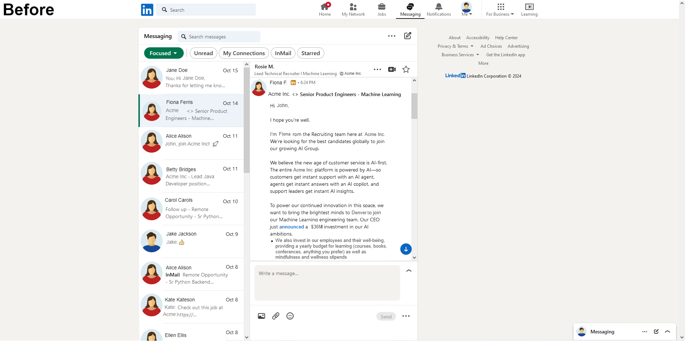
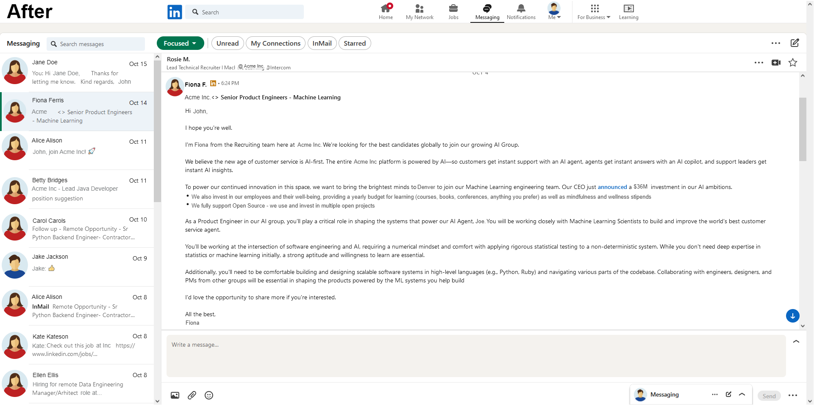

## LinkedIn Messaging Full Screen
A browser extension to go Full Screen on the LinkedIn Messaging. Useful when reading/writing LinkedIn
messages in the browser on a large screen (Desktop/Laptop).





### Supported browsers


### Installation
#### Latest release
* Firefox
    * go to homepage of the extension on [Firefox Addons](https://addons.mozilla.org/en-US/firefox/addon/linkedin-messaging-full-screen/) and click **Add to Firefox**
* Chrome
    * go to homepage of the extension on [Chrome Web Store](https://chromewebstore.google.com/detail/linkedin-messaging-full-s/fcmabommedlkihpccnlbfdgedlaonick) and click **Add to Chrome**

#### Development
* Firefox
    * Open menu -> Add-ons (or `Ctrl` + `Shift` + `A`) -> Settings -> Install add-on from file -> Select source directory
* Chrome
    * Type `chrome://extensions/` in the address bar and hit `Enter` -> Load unpacked -> Select source directory


### Building the plugin from source

#### Pre-requisites

The following dependencies with their versions are required to build the plugin.
Prior versions of these dependencies will likely work as well:

- node 20.18.0+
- typescript 5.6.2+
- npm 10.8.2+
- zip (Linux command line tool)

To install `node` and all the `npm` modules,
run the following in terminal (required only the first time):

#### Linux
```
apt-get install -y node
npm install
```

#### OS X
```
brew install node
npm install
```
To build the plugin, run:
```
npm run build
```
This will create a **.zip** file which contains all the content required for the web store.

#### To package sources for evaluation, which is necessary for Firefox Developer Hub, run:
```shell
zip source.zip linkedin-messaging-full-screen.ts icons/*.png manifest.json package.json package-lock.json tsconfig.json docs/img/*.png
```